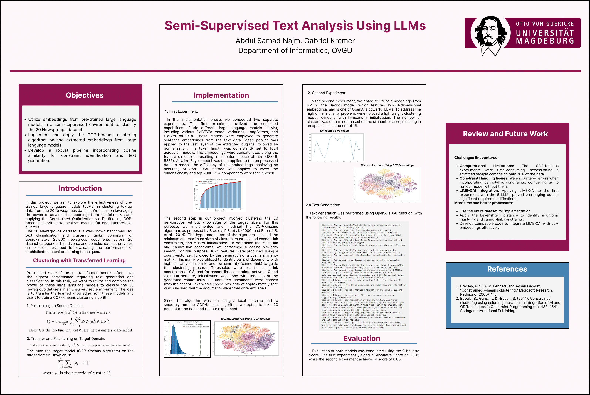

# Semi-Supervised-Text-Analysis-Using-LLMs
## Overview
This project explores the effectiveness of pre-trained Large Language Models (LLMs) in clustering textual data from the 20 Newsgroups dataset. By leveraging embeddings from multiple LLMs, we applied the COP-Kmeans algorithm to create meaningful clusters, facilitating unsupervised text analysis.

## Dataset
20 Newsgroups: 20,000 documents across 20 categories, used as a benchmark for clustering tasks.

## Methodology

- **Embedding Extraction**: Used six LLMs (e.g., DeBERTa, LongFormer) to generate sentence embeddings, followed by dimensionality reduction.
- **Clustering**: Applied the COP-Kmeans algorithm with must-link and cannot-link constraints derived from cosine similarity.
- **Evaluation**: The Silhouette Score was used to evaluate clustering quality, with scores of -0.26 and 0.03 in two experiments.

## Poster Project
 

## References
- Bradley, P. S., Bennett, K. P., & Demiriz, A. (2000). "Constrained k-means clustering."
- Babaki, B., Guns, T., & Nijssen, S. (2014). "Constrained clustering using column generation.
